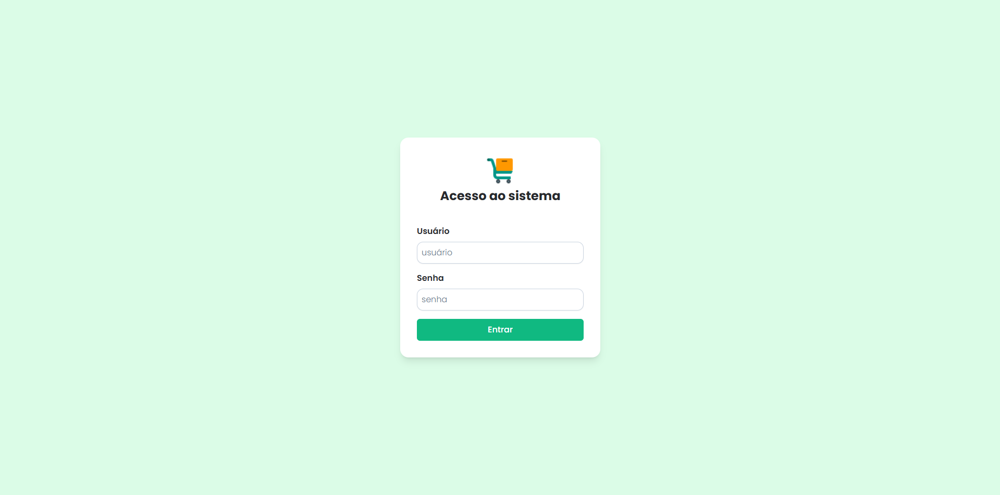
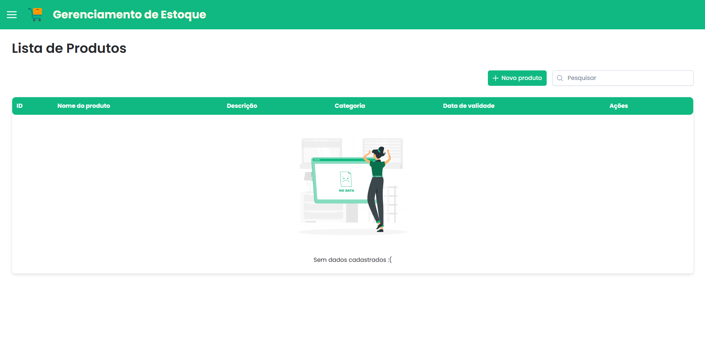
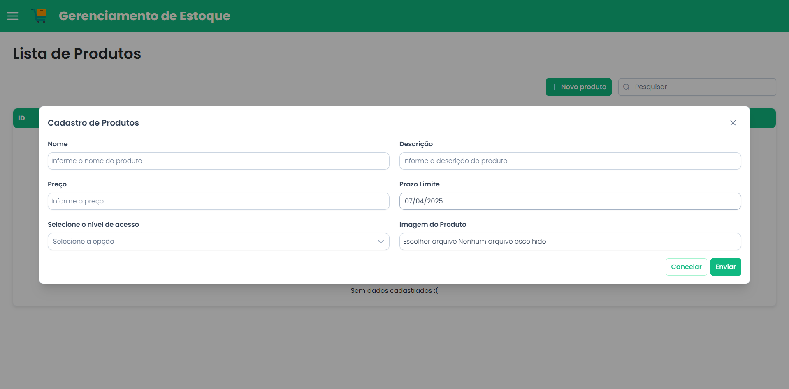
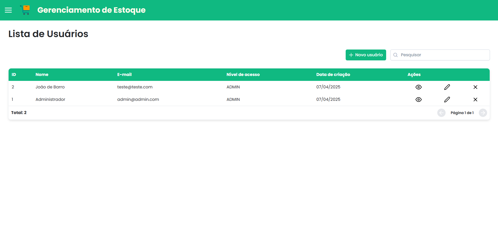
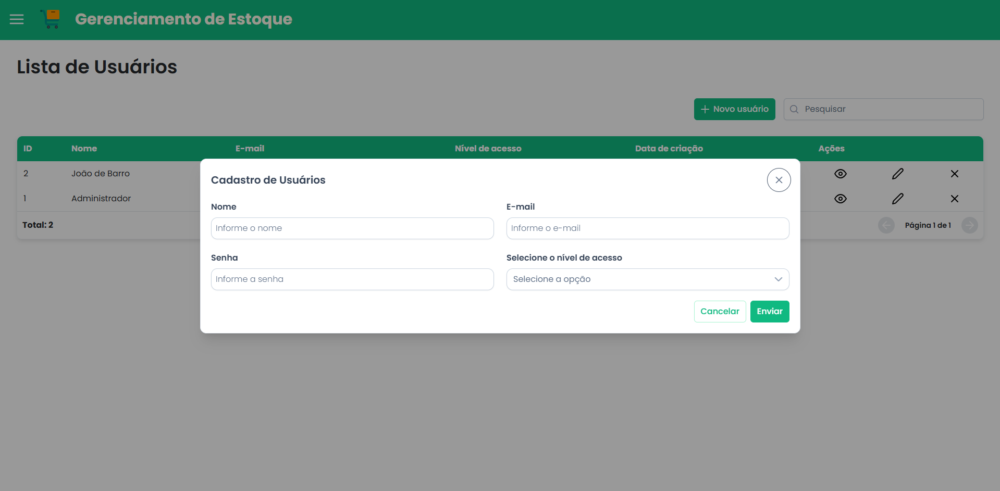
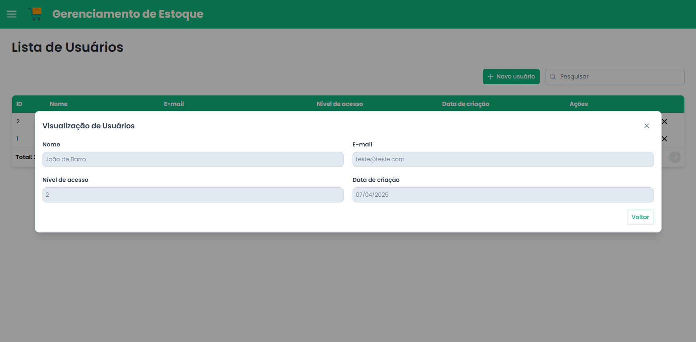
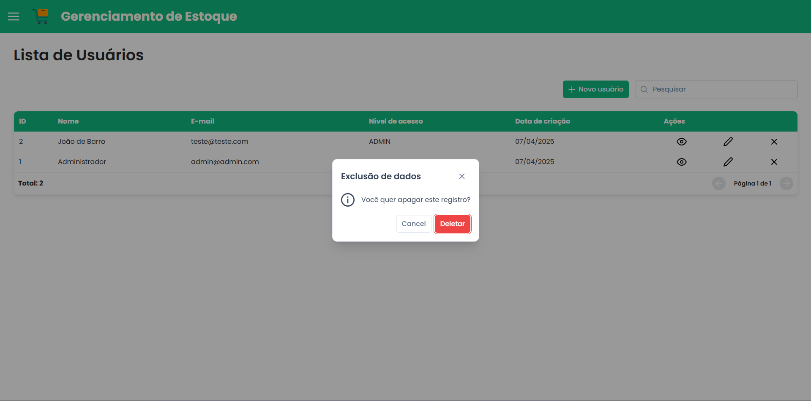
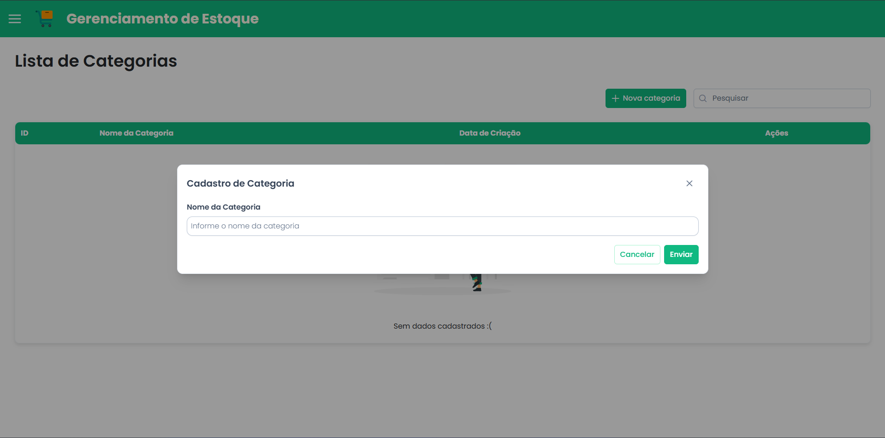
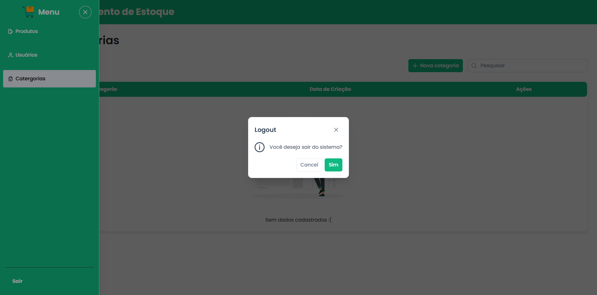

# Desafio Técnico - Desenvolvedor FullStack

Este sistema fullStack foi desenvolvido para gerenciar estoque de forma eficiente, com autenticação segura e uma interface moderna e responsiva. O projeto é dividido entre backend (API REST) e frontend (interface web).


### Observação 
```bash
  Tentei executar o projeto com um unico comando do docker, por falta de tempo e algunas problemas nas tipagens do typescript no projeto frontend. Isso acabou me deixando na mão.
```
## 📔 Linguagens e libs utilizadas 

🔧 Tecnologias Utilizadas
### Backend
- NestJS: Framework Node.js para construir APIs escaláveis usando TypeScript e arquitetura modular.

- MySQL: Banco de dados relacional utilizado para armazenar informações persistentes da aplicação.

- Prisma ORM: ORM moderno para TypeScript que facilita o acesso ao banco de dados com tipagem estática.

- class-validator: Biblioteca para validação declarativa de dados recebidos nos DTOs.

- Swagger: Ferramenta para geração automática de documentação interativa da API REST.

- JWT (JSON Web Token): Método utilizado para autenticação e autorização baseada em tokens.

### Frontend
- Vue 3 (Composition API): Framework JavaScript progressivo para construir interfaces reativas com uma abordagem funcional.

- PrimeVue: Biblioteca de componentes UI ricos e responsivos para Vue.js.

- Axios: Cliente HTTP baseado em Promises para realizar requisições assíncronas à API.

- TypeScript: Superset do JavaScript que adiciona tipagem estática ao código, aumentando a confiabilidade.

- Pinia: Gerenciador de estado moderno e leve para aplicações Vue.js.

- Vue Router: Biblioteca de roteamento oficial do Vue.js para navegação entre páginas.

- Yarn: Gerenciador de pacotes que facilita a instalação e controle de dependências do projeto.


## ⚙️ Funcionalidades 

- Cadastros de Produtos, Categorias, Usuários
- Listagem de Produtos, Categorias, Usuários
- Visualização de Produtos, Categorias, Usuários
- Edição de Produtos, Categorias, Usuários
- Busca por Produtos, Categorias, Usuários
- Logout do sistema

Para a persistência de dados esta sendo usado a API que foi desenvolvido para a execução das funcionalidades do frontend.
## ♟️ Variáveis de Ambiente 
Para rodar esse projeto, você vai precisar adicionar as seguintes variáveis de ambiente no seu .env


## ♟️ Executando localmente com Docker

Clone o projeto

### Backend

```bash
  git clone https://github.com/MaikonLima/INNYX.git
```

Entre no diretório do projeto

```bash
  cd backend-app
```

Crie um arquivo de .env

```bash
# App
PORT=3333
ENVIROMENT=development

# Database - Prisma
DB_HOST=localhost
DB_PORT=3306
DB_DATABASE=db_stock
DB_USER=root
DB_PASSWORD=stock123
DB_ROOT_PASSWORD=stock123

DATABASE_URL="mysql://${DB_USER}:${DB_ROOT_PASSWORD}@${DB_HOST}:${DB_PORT}/${DB_DATABASE}"

# Docker - db
MYSQL_DATABASE="${DB_DATABASE}"
MYSQL_ROOT_PASSWORD="${DB_ROOT_PASSWORD}"
MYSQL_USER="${DB_USER}"
MYSQL_PASSWORD="${DB_PASSWORD}"
```


Execute os seguintes comandos antes de construir a imagem:

```bash
    npx prisma generate

    npx prisma migrate dev (o nome pode ser init)

    npm run seed (para criação do usuário ADMIN)
```
E em seguida, execute o comando abaixo para criação da base de dados:

```bash
    docker-compose up -d
```

Acessar o Backend
Verifique se o backend está rodando:

O backend estará acessível na porta 3000 por padrão (ou conforme configurado no seu Dockerfile e docker-compose.yml).
Acesse a API:

Você pode acessar o backend no navegador ou usar uma ferramenta como Postman para testar as rotas da sua API em http://localhost:3333/api/documentation.


### Frontend

Entre no diretório do projeto

```bash
  cd frontend-app
```

Crie um arquivo de .env

```bash
VITE_BACKEND_URL="http://localhost:3333/"
VITE_FRONT_URL="http://localhost:5173"
```

apos, entrar no projeto frontend. Execute os seguintes comandos:

```bash
npm install ou yarn (instalar depedencias)

yarn dev
```

Se tudo correr bem, a url para acessar o sistema será esse:
http://localhost:5173/login

## Capturas de Tela




















## Autores

- [@maikonLima](https://www.github.com/maikonLima)


## 🔗 Links
[](https://katherineoelsner.com/)
[](https://www.linkedin.com/)
[](https://twitter.com/)

